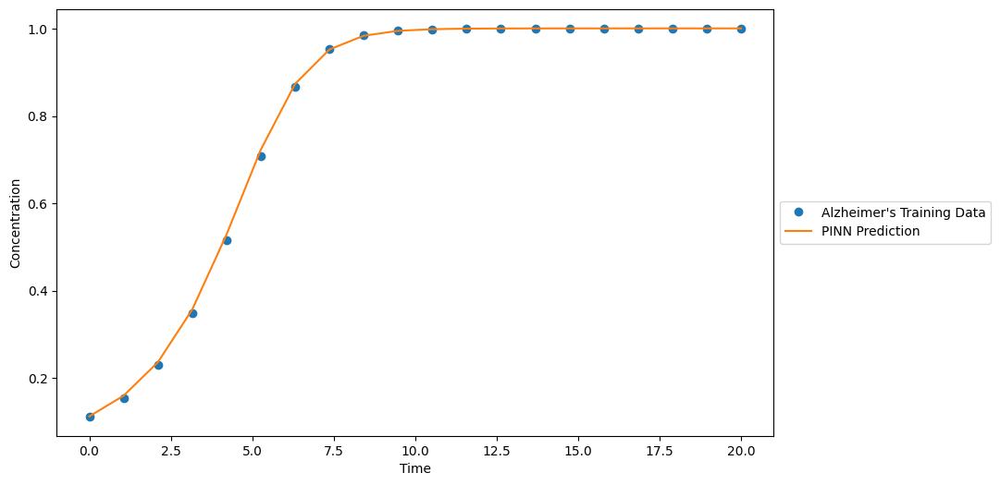

# *PINN for solving PDE and Its application in Alzheimer’s disease**

## **Overview** 
Its a research project focused on advancing the early diagnosis of **Alzheimer’s disease** by integrating **partial differential equations (PDEs)**, **Physics-Informed Neural Networks (PINNs)**, and **symbolic regression**. This project explores tau protein diffusion in the brain, aiming to predict the reaction term in the reaction-diffusion PDE that governs its behavior.
Through this interdisciplinary approach, we aim to contribute to **healthcare innovation** by providing tools for better understanding Alzheimer’s progression and enhancing diagnostic precision.

The equation is given as:

$$
\frac{\partial c}{\partial t} = \nabla \cdot (D \cdot \nabla c) + f(c)
$$

Where:
- \(c\): Concentration
- \(D\): Diffusion coefficient (tensor or scalar)
- \(f(c)\): Reaction term

---

## **Features**
- 🧠 **Tau Protein Diffusion Modeling**: Simulated tau protein spread in the brain using the reaction-diffusion PDE.  
- 🤖 **Physics-Informed Neural Networks (PINNs)**: Combined physics and data to predict the reaction term in the PDE.  
- 🔬 **Symbolic Regression**: Discovered interpretable mathematical expressions for the reaction term.  
- 📊 **Visualization**: Simulated and visualized tau protein diffusion patterns in a 2D brain-like geometry.  
- 🛠️ **Web Interface**: Dynamic webpage to interactively present diffusion results and project insights.  
- 🧪 **Data Integration**: Used synthetic training data and PET scan data from the **ADNI** database for parameter extraction.

---

## **How It Works**
### 1. **Training and Prediction**
- Trained **PINNs** to predict the unknown reaction term in the reaction-diffusion PDE.
- Used **symbolic regression** to derive interpretable reaction equations.

### 2. **Simulation**
- Simulated tau protein diffusion in a 2D brain-like shape using **COMSOL**.
- Applied the predicted reaction term to visualize diffusion patterns.

### 3. **Visualization**
- Developed an interactive webpage to dynamically present results and insights.

---

## **Getting Started**
### Prerequisites
- Python 3.8+
- COMSOL Multiphysics (for simulations)
- Jupyter Notebook

### Installation
1. Clone the repository:
   ```bash
   git clone https://github.com/your-username/mind-code.git
   cd mind-code
   ```
2. Install dependencies:
   ```bash
   pip install -r requirements.txt
   ```

3. Run the result notebook:
   ```bash
   jupyter notebook
   ```

4. View the dynamic webpage:
   ```bash
   cd web_interface
   python -m http.server
   ```

---

## **Results**
### Key Highlights
- Discovered reaction terms that match synthetic ground truth equations with high accuracy.
- Demonstrated diffusion patterns of tau protein in a 2D brain model.
- Improved PET scan quality using the heat equation for denoising.

---

## **Future Work**
- Extend the model to simulate 3D brain geometries.
- Test on additional real-world PET datasets.
- Explore the application of PINNs for other neurodegenerative diseases.

---

## **Acknowledgments**
- **ADNI** for providing PET scan data.  
- **COMSOL** for simulation tools.

---
